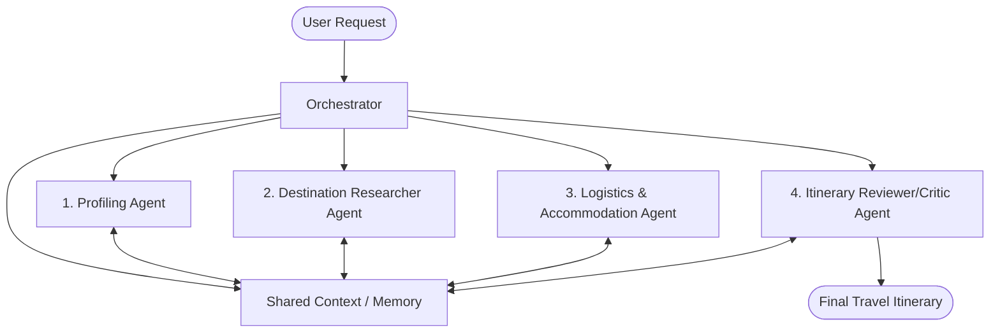
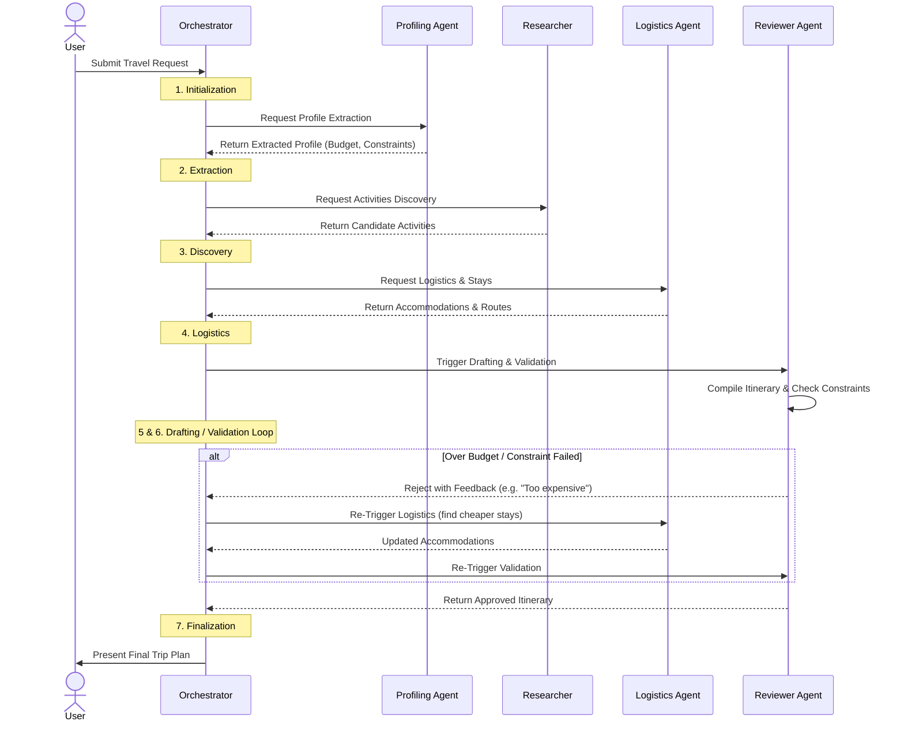

# Multi-Agent Travel Planner - System Architecture

## Overview
The Travel Planning Multi-Agent System uses a decentralized, specialized approach where multiple AI agents collaborate to fulfill a complex travel request. By dividing the workload, each agent focuses on a specific domain (e.g., research, logistics, budgeting), mimicking a team of human travel experts.

## Core Architecture

The architecture consists of a central **Orchestrator Agent** that coordinates tasks among several **Specialist Agents**. A **Shared State (Memory)** is used to pass context and intermediate results between agents.

## Agent Definitions and Responsibilities

### 1. Orchestrator Agent (The Manager)
- **Role:** Manages the workflow and execution pipeline.
- **Responsibilities:**
  - Receives the natural language prompt from the user.
  - Triggers specialist agents in the correct sequence.
  - Handles fallback if the reviewer rejects the proposed itinerary.

### 2. Profiling Agent (The Analyzer)
- **Role:** Extracts structured data from unstructured user input.
- **Responsibilities:**
  - Identifies destinations (e.g., Tokyo, Kyoto).
  - Extracts constraints (e.g., $3,000 budget, 5 days).
  - Understands preferences (e.g., loves food/temples, hates crowds).
  - Populates the initial *Travel Profile* in the Shared State.

### 3. Destination Researcher Agent (The Local Guide)
- **Role:** Discovers activities and points of interest.
- **Responsibilities:**
  - Queries external APIs or knowledge bases for attractions matching preferences (e.g., quiet temples, highly-rated food spots).
  - Filters out locations that violate constraints (e.g., overcrowded tourist traps).
  - Creates a pool of candidate activities and dining options.

### 4. Logistics & Accommodation Agent (The Booking Agent)
- **Role:** Handles physical movement and stays.
- **Responsibilities:**
  - Suggests optimal neighborhoods to stay based on the candidate activities.
  - Estimates transportation options and costs between cities (e.g., Shinkansen from Tokyo to Kyoto).
  - Provides budget-friendly hotel or Airbnb recommendations that fit the remaining budget.

### 5. Itinerary Reviewer & Compiler Agent (The Critic)
- **Role:** Assembles the final plan and ensures quality control.
- **Responsibilities:**
  - Drafts the day-by-day itinerary using outputs from the Researcher and Logistics agents.
  - Tallies up the estimated costs to ensure they fall under the $3,000 budget.
  - Cross-references the final plan against the original constraints (e.g., did we accidentally include a crowded location?).
  - If the plan fails validation, it provides feedback and requests the Orchestrator to run specific agents again (e.g., "Find cheaper hotels to meet the budget").
  - Formats the final output for the user.

## Data Flow & Execution Sequence

1. **Initialization:** User submits the prompt. Orchestrator initializes a shared JSON state.
2. **Extraction:** Profiling Agent parses the prompt and updates the state with `budget`, `duration`, `preferences`, etc.
3. **Discovery:** Destination Researcher generates a list of potential daily activities.
4. **Logistics:** Logistics Agent calculates travel times, costs, and selects accommodations.
5. **Drafting:** Reviewer Agent compiles a cohesive schedule.
6. **Validation Loop:** Reviewer checks total cost and constraint alignment. If there are issues (e.g., over budget), it loops back to the Logistics or Researcher agent to swap options.
7. **Finalization:** The approved itinerary is presented to the user.
