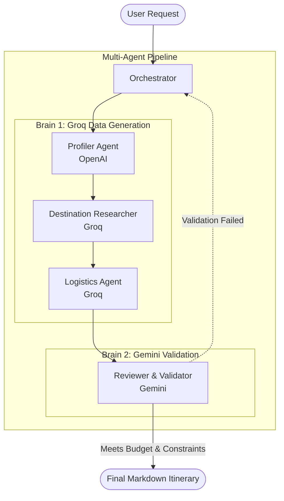

# Implementation Plan: Multi-Agent Travel Planner

This document outlines the phase-wise implementation plan to build the Multi-Agent Travel Planner, as well as the strategy for data acquisition across various domains.

## Overall Project Strategy
- **Current Project Phase (Phase 1):** Fully LLM-driven approach. The system uses an LLM as a mock database to simulate live APIs. This avoids latency, costs, and API key management while still demonstrating the core multi-agent workflow.
- **Future Project Phases:** We will integrate real external APIs (e.g., Google Places, Amadeus, Rome2Rio) to fetch live data for production use.

## Data Sourcing Strategy (Phase 1 - LLM Mock Data)

To fulfill the requirements of researching destinations, comparing hotels, and managing a budget efficiently for this proof of concept, we use an **LLM as a Mock Database**.

### Two-Brain Flow Architecture

### 1. Destination & Attraction Data
- **Sources:** LLM internal knowledge (using **Groq**).
- **Usage:** The Destination Researcher Agent prompts the Groq LLM to generate realistic, structured JSON for highly-rated activities that match user preferences.
- **Metrics mocked:** Names, realistic ratings, estimated time spent, and reasonable pricing.

### 2. Accommodation Data
- **Sources:** LLM internal knowledge (using **Groq**).
- **Usage:** The Logistics Agent prompts the Groq LLM to generate realistic hotel or rental options in target neighborhoods that fit the user's budget.
- **Metrics mocked:** Fictional or real hotel names, realistic nightly rates, and location details.

### 3. Transport & Logistics Data
- **Sources:** LLM internal knowledge (using **Groq**).
- **Usage:** The Logistics Agent prompts the Groq LLM to estimate travel routes and costs between cities.
- **Metrics mocked:** Transit modes, realistic durations, and ticket costs.

### 4. Budgeting & Validation Data
- **Sources:** LLM internal reasoning (using **Gemini**).
- **Usage:** The Reviewer/Validator Agent uses Gemini to aggregate the mocked costs, check constraint adherence, and provide critical feedback if the itinerary fails budget or preference checks. Using a separate "brain" (Gemini) ensures robust validation against Groq's generation.

---

## Agent Implementation Steps

### Step 1: Project Setup & Orchestration Foundation
- Initialize the project repository in Python.
- Set up the **Shared State (Memory)** structure to hold the `TravelProfile`, `Candidate Activities`, `Logistics`, and `Final Itinerary`.
- Implement the basic **Orchestrator Agent** skeleton to handle the initialization and sequence execution.

### Step 2: User Profiling Agent
- Implement the **Profiling Agent** to parse natural language requests.
- Use an LLM to extract structured JSON data: Destinations, Budget, Duration, Preferences, and Constraints.
- Ensure the extracted data populates the Shared State correctly.

### Step 3: Data Integration Layer
- Create service wrappers for the LLM mock data queries.
- Expose unified interfaces (e.g., `getHotels(city, budget)`, `getAttractions(city, preferences)`) for the agents to use.

### Step 4: Specialist Agents (Researcher & Logistics)
- Implement the **Destination Researcher Agent** to query the LLM data layer and populate candidate activities into the Shared State.
- Implement the **Logistics & Accommodation Agent** to query travel routes and hotel stays via the LLM, filtering out options that drastically exceed daily budget averages.

### Step 5: Itinerary Reviewer & Validation Loop
- Implement the **Reviewer/Critic Agent** to assemble the data from the Shared State into a cohesive day-by-day plan.
- Implement the **Validation Loop**: Calculate total costs and verify constraints (e.g., "no crowds").
- Add the feedback mechanism: If validation fails, instruct the Orchestrator to re-trigger the Logistics or Researcher agents with modified prompts (e.g., "Find cheaper hotels").

### Step 6: Polish & Output Formatting
- Format the final approved itinerary into a clean, readable structure (Markdown or JSON).
- Add error handling and fallback messages (e.g., "A $500 budget is too low for a 5-day Japan trip").
- Final end-to-end testing with various natural language prompts.
